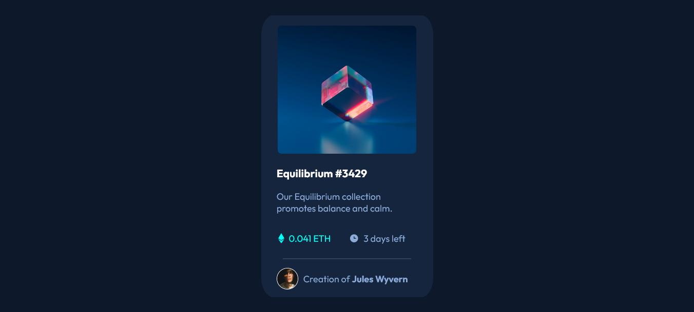
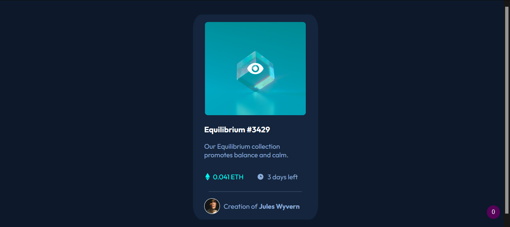
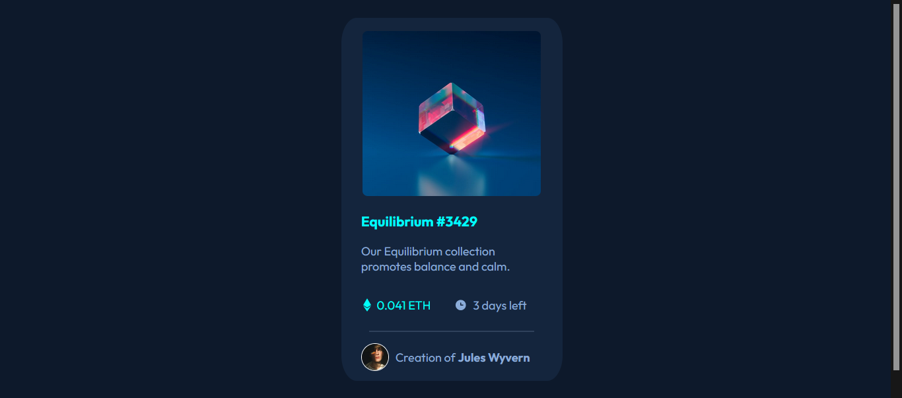
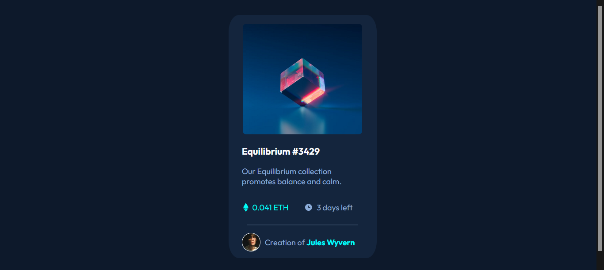

# Frontend Mentor - NFT preview card component solution by Vincent Dsouza

This is my solution to the NFT Card Preview challenge [Frontend Mentor](https://www.frontendmentor.io/challenges/nft-preview-card-component-SbdUL_w0U). 

## Table of contents

- [Overview](#overview)
  - [The challenge](#the-challenge)
  - [Screenshot](#screenshot)
  - [Links](#links)
- [My process](#my-process)
  - [Built with](#built-with)
  - [What I learned](#what-i-learned)
  - [Continued development](#continued-development)
  - [Useful resources](#useful-resources)
- [Author](#author)
- [Acknowledgments](#acknowledgments)

## Overview

### The challenge
Users should be able to:

- View the optimal layout depending on their device's screen size
- See hover states for interactive elements

### Screenshot
The site has default and active states. Active states include hovering on three seperate elements

Default Site

Image Hover

Heading Hover

Name Hover

### Links

- Solution URL: [Solution Code](https://github.com/VincentX33/NftDisplayProject)
- Live Site URL: [Live Site](https://vincentx33.github.io/NftDisplayProject/)

## My process

### Built with

- HTML
- Used Flexbox to manage the outer card as well as the inner attribute elements
- Used grid to achieve image superposition for the hover state

### What I learned

The project was pretty simple, but inexperience plays a part in making simple things difficult. My greatest mistake was in being overly ambitious from the start: I designed the outer flexbox before actually getting a working card. This meant that I had to go through a lot more headbutting than I would have needed to if I had only designed everything step by step.
Getting specific text elements to change font color on mouse hover wasn't difficult, but it was the image hover that challenged me. A lot of googling and reading code from other websites having similar effect using Firefox's inspect element finally taught me the necessary details, but I had to go through trial and error to achieve matched images. But it was worth it!!!

### Continued development
Of course, the site is far from perfect. While it displays the required static page, it still lacks the level of responsiveness I'd like to achieve. As I keep learning, I'll keep trying to improve it.
### Useful resources
- Google remains a developer's best resource, but reading open source code on github is underrated teaching aid.
- GeeksForGeeks has impressive point-to-point doubt clearing posts about various topics
## Author

- Frontend Mentor - [@VincentX33](https://www.frontendmentor.io/profile/VincentX33)
- Twitter - [@V1nceeeent](https://www.twitter.com/V1nceeeent/)
