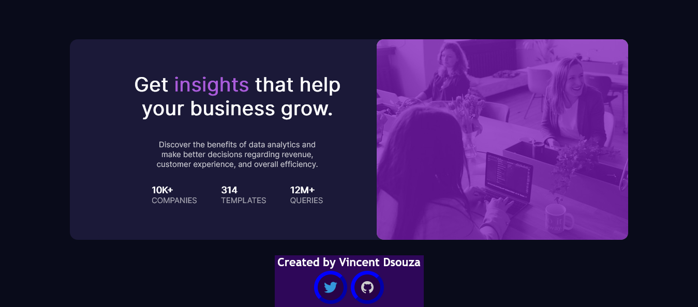
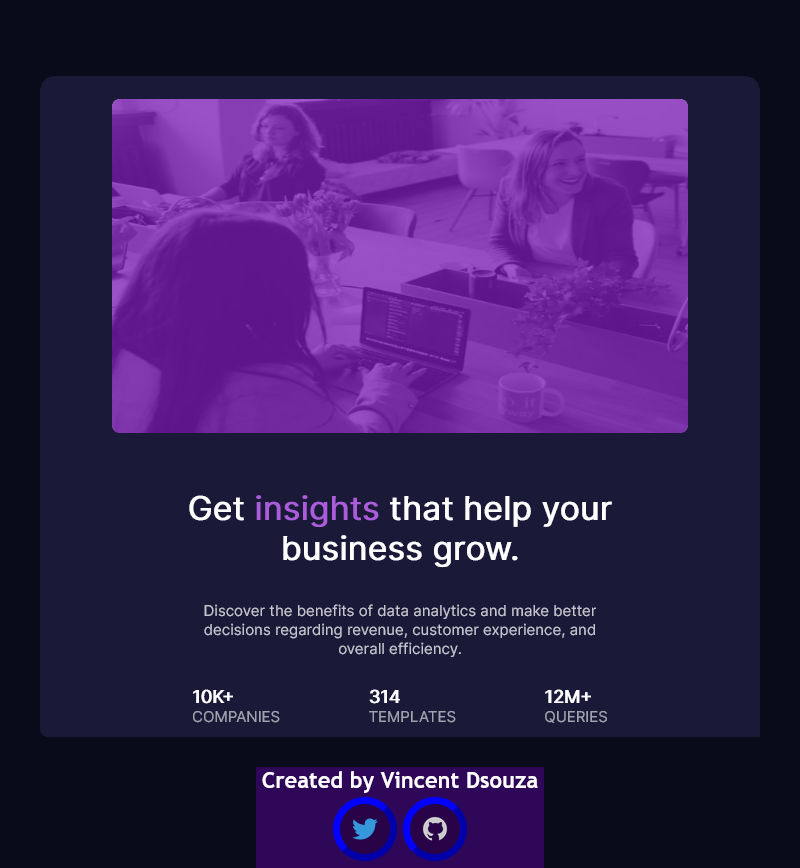
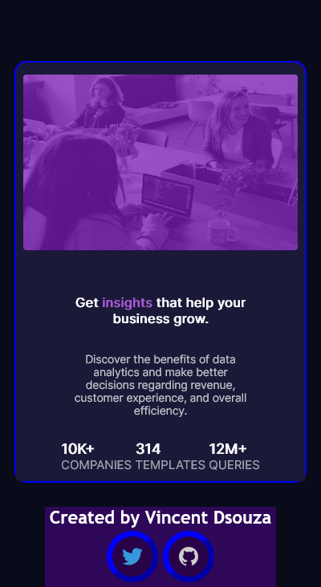

# Frontend Mentor - Stats preview card component solution

This is my solution to Frontend Mentor's [Stats preview challenge](https://www.frontendmentor.io/challenges/stats-preview-card-component-8JqbgoU62).
## Table of contents

- [Overview](#overview)
  - [The challenge](#the-challenge)
  - [Screenshot](#screenshot)
  - [Links](#links)
- [My process](#my-process)
  - [Built with](#built-with)
  - [What I learned](#what-i-learned)
  - [Continued development](#continued-development)
  - [Useful resources](#useful-resources)
- [Author](#author)

## Overview

### The challenge

Users should be able to:

- View the optimal layout depending on their device's screen size

### Screenshot

#### Desktop design

#### Desktop design 2 (reduced width)

#### Tablet design

#### Mobile design

### Links

- Solution URL: [Source Code](https://github.com/VincentX33/Stats-Preview-Challenge)
- Live Site URL: [Live site](https://vincentx33.github.io/Stats-Preview-Challenge/)

## My process

### Built with

- HTML5 Markup
- CSS3
- Used Flexbox for the design
- Learnt how to use media queries to attain responsive web design
- Attained colored overlay on image 

### What I learned
With every new challenge one takes up, there is potential for learning. 
The first layout I tried to achieve by using floats and position properties. That didn't work. 
I spent over 3 hours trying to align everything, and at the end of the day, frustrated, decided to start afresh, right from scratch. Started with one div: the picture of the women at work and attempted to achieve color overlay. That done, worked on the other box containing the info. 
Added styling individually to each component of the info card.
The next step was achievind desired static layout. Did that using flexbox, which, have to say, was the easiest part. Used percentage units to ensure that the site works for more than one resolution.
Once the static desktop site was ready, I learnt about media queries and incorporated it into the site.
It took four days: the first day spent working on something that I later discarded, the second day I coded for two hours before going to watch Batman (loved it). The third day I didn't code at all, because it was my 19th birthday and I was inundated with greetings from loved ones. Refreshed (and older), worked till completion the next day.
While this wasn't by an stretch a genuinely difficult project, it did challenge me. Learning how to cope with frustration and boredom is essential for every developer. I am proud that I kept my sanity.
This project also pushed me into corners where I learnt new things. Now I know the basics of responsive web design principles, what "mobile-first" means and so on. That said, there are lots of other things I need to improve at. Flexbox is cool, but I have to learn how to achieve similar product using floats and position only. Foundation is always very important.

### Continued development
I want to develop the same website while replacing flexbox with floats

### Useful resources

- Google your queries
- W3Schools

## Author

- Frontend Mentor - [@VincentX33](https://www.frontendmentor.io/profile/VincentX33)
- Twitter - [@V1nceeeent](https://www.twitter.com/V1nceeeent/)
- Hashnode - [@VincentDsouza](https://hashnode.com/@VincentDsouza)